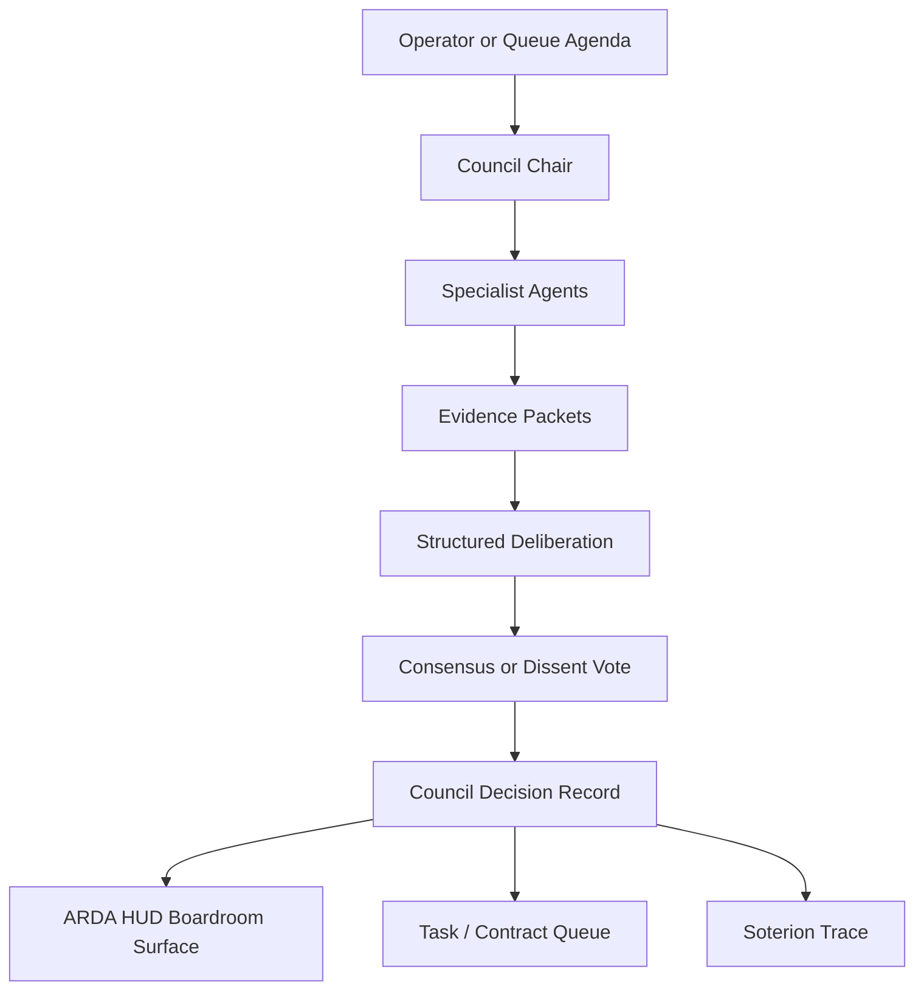

---
soterion:
  sigil: "SCROLL"
  glyph: "📜"
  code_point: "U+1F4DC"
  role: "documentation"
  owner: "HADES"
  status: "active"
  last_reviewed: "2026-05-21"
---

> 🜏 Soterion: 📜 documentation | owner: HADES | status: active | reviewed: 2026-05-21

# annunimas-council

## Purpose
Multi-agent boardroom deliberation and consensus building.

## Vision

`annunimas-council` is the ARDA deliberation layer: it models how specialist
agents bring evidence, constraints, votes, and dissent into a bounded decision
process. The goal is not unstructured chat between agents; it is inspectable
boardroom governance that can produce consensus, record minority objections, and
hand explicit decisions back to execution surfaces.

## Getting Started

```bash
cargo test
cargo doc --no-deps
```

Use the crate to define and validate council records before wiring any live
agent runtime into the boardroom process.

## Architecture Overview



## Relationship to ARDA

Council is ARDA's deliberation and governance layer. It should produce bounded
decision records, dissent, and escalation context for HUD and task queues rather
than executing background work directly.

## Status

Blueprint-stage Rust crate for multi-agent boardroom records and consensus
surfaces.

## Key Components

- agenda intake for operator or queue-raised decisions
- specialist agent positions and evidence packets
- consensus, dissent, and escalation records
- decision exports for ARDA HUD and task queues

## Integration

`annunimas-council` should integrate with ARDA as a governance source, not as a
background executor. Execution remains gated by task queues, tool policy, and
audit receipts.

## See Also
- [ANNUNIMAS_ROOT_PROTOCOL.md](/var/home/mythos/Annunimas/ANNUNIMAS_ROOT_PROTOCOL.md)
- [CODEMAP.md](/var/home/mythos/Annunimas/CODEMAP.md)
- [core/projects/tasks/queue.jsonl](/var/home/mythos/Annunimas/core/projects/tasks/queue.jsonl)
